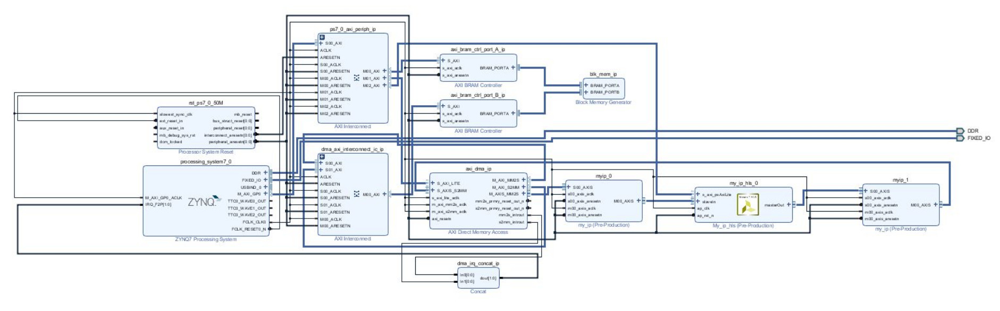

# Reconfigurable-Computing  

Introduction in Reconfigurable Computing using reconfigurable Systems-on-Chip. This project is an educational implementation of a custom IP module that communicates with DMAe using the AXI4 Stream Protocol. It consists of 3 different phases (Milestones).

## Phases
### [Milestone 1](./Milestone-1/)
Use VHDL to design a FIFO queue that will feed later the custom IP module with packets.

### [Milestone 2](./Milestone-2/)
Using HLS implement a custom IP module that filters incoming packets based on predefined rules.

### [Milestone 3](./Milestone-3/)
Combine IPs from the first two Milestones upon a complete - reference - system and establish communication with DMAe to transfer, filter packets and write back valid ones to BRAM. 

## Final's Phase - Top Module Block Diagram

## Enviroment
This project was developed using both [Xilinx Vivado 2017.4](https://www.xilinx.com/support/download/index.html/content/xilinx/en/downloadNav/vivado-design-tools/2017-4.html) and [Xilinx Vivado HLS 2017.4](https://www.xilinx.com/support/download/index.html/content/xilinx/en/downloadNav/vivado-design-tools/2017-4.html)
